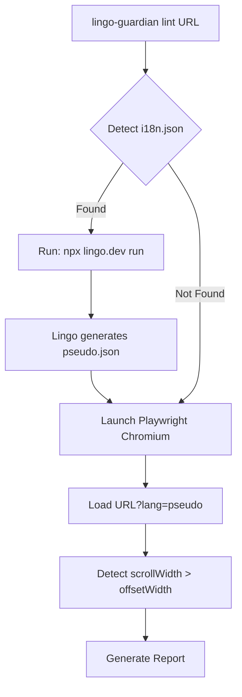

# Lingo-Guardian - Walkthrough

## ✅ Cross-Platform CLI Working!

Successfully tested on macOS with Playwright:

```
╔═══════════════════════════════════════════════════════════╗
║   🛡️  LINGO-GUARDIAN                                      ║
║   Powered by Lingo.dev                                    ║
╚═══════════════════════════════════════════════════════════╝

  [Auditor] Launching Playwright browser (Chromium)...
  [Auditor] Navigating to https://example.com/?lang=en...
✔ Audit complete!

📊 Summary
   Locales tested: en
   Total issues: 0
 PASS  No i18n layout issues detected! 🎉
```

---

## 🌍 Cross-Platform Support

| Platform | Status |
|----------|--------|
| macOS | ✅ Verified |
| Windows | ✅ Playwright handles |
| Linux | ✅ Playwright handles |

**Playwright automatically manages browser binaries** for all platforms.

---

## 🔥 Lingo.dev Integration Flow



---

## 📁 Key Files

| File | Purpose |
|------|---------|
| [lingo-integration.ts](file:///Users/ashpreetsinghanand/Desktop/lingo-guardin/packages/cli/src/core/lingo-integration.ts) | Wraps Lingo.dev CLI |
| [auditor.ts](file:///Users/ashpreetsinghanand/Desktop/lingo-guardin/packages/cli/src/core/auditor.ts) | **Playwright** browser automation |
| [pseudo-locale.ts](file:///Users/ashpreetsinghanand/Desktop/lingo-guardin/packages/cli/src/transforms/pseudo-locale.ts) | Text expansion fallback |
| [lint.ts](file:///Users/ashpreetsinghanand/Desktop/lingo-guardin/packages/cli/src/commands/lint.ts) | Main CLI command |

---

## ✅ Phase 1 Complete

- [x] Lingo.dev CLI integration
- [x] Playwright cross-platform browser
- [x] Overflow detection (`scrollWidth > offsetWidth`)
- [x] Pseudo-locale & RTL transforms
- [x] Table/JSON/HTML reporters
